# punk

<p align="center">
  
</p>

`punk` is an experimental, early-stage, local-first bounded work kernel and sandbox for developers, researchers, and experimenters.

It exists to explore bounded AI work, project memory, contracts, evals, and proof-bearing workflows.

It is not a finished product, not production-ready, and not guaranteed to work end-to-end out of the box.

Live landing: [punks.run](https://punks.run)

## Current direction

Start core-first.

Create the workspace and documentation boundaries early. Activate behavior slowly.

A crate, folder, module, adapter, or public narrative surface may exist before it is part of the active operator path.

## First principle

One CLI. Many modules. Shared laws. Project memory. Proof-bearing work.

The lifecycle grammar is:

```text
plot -> cut -> gate
```

## Active target

The current active target is the stable core:

- project identity
- flow state machine
- append-only event log
- minimal local eval harness
- simple contract lifecycle
- gate decision
- proofpack
- inspectable state
- project memory links

See:

- `docs/product/START-HERE.md`
- `docs/product/ROADMAP.md`
- `docs/product/CRATE-STATUS.md`

## Not active yet

The following may be documented or parked, but they are not current operator surfaces:

- LLM contract drafting
- coding agent execution
- PubPunk publishing automation
- provider adapters
- MCP integration
- knowledge embeddings
- plugin marketplace
- council
- skill auto-promotion
- cloud sync or SaaS control plane

## Documentation system

Punk docs follow a source-of-truth map to avoid duplicate or conflicting claims.

Meaningful changes should declare `DocImpact`, update the canonical owner, and preserve superseded truth instead of silently deleting it.

Start with:

- `docs/product/START-HERE.md`
- `docs/product/DOCUMENTATION-MAP.md`
- `docs/product/GLOSSARY.md`
- `docs/product/PUNK-LAWS.md`
- `docs/product/ARCHITECTURE.md`
- `docs/product/DOC-GOVERNANCE.md`

Research and ideas are stored separately:

- research notes: `knowledge/research/`
- idea backlog: `knowledge/ideas/`

Research and ideas do not become product truth until promoted through ADR, roadmap, contract, implementation, eval, and proof.

## Dogfooding

`punk` is developed with `punk`, but only at the trust level it has earned.

At first this means self-tracking:

- goals in `work/goals/`
- reports in `work/reports/`
- knowledge in `knowledge/`
- decisions in `docs/adr/`

Self-execution comes later, after flow, eval, contract, gate, and proof are stable enough.

See `docs/product/DOGFOODING.md`.

## Public build

`punk` is a public build from day zero.

Stories, post drafts, manual publication receipts, and metrics snapshots live under `public/`.

Future PubPunk automation must adopt that structure instead of creating a hidden content store.

See `docs/product/PUBLIC-NARRATIVE.md`.
